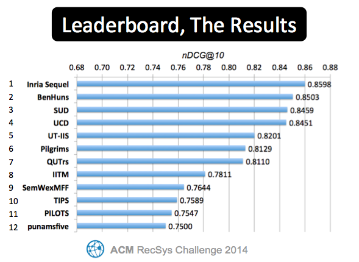

#How to evaluate
The final evaluation will be performed by the organizers at the end of the challenge period. Before this period however, participants can calculate their intermediate progress on the provided public test set and upload the results on the leaderboard (see below). The intermediate results can be calculated using the [RecSysChallenge Evaluator](https://github.com/recsyschallenge/RSChallengeEval/releases) (**Note**: always use the most recent release of the evaluator):

    java -jar rscevaluator-0.14-jar-with-dependencies.jar test_solution.dat participant_solution.dat

The **test_solution.dat** file can be found in the dataset, the **participant_solution.dat** file is the file generated by the participants with the predicted tweet rankings. The exact formatting specifications of this file (e.g., sorting order) can be found in the [dataset](/dataset) section.

The nDCG@10 result as returned by the RecSyschallenge evaluator (e.g. *0.924849*) may then be submitted on the leaderboard below. [Contact the organizers](/organizers) if you should run into problems.

#The Final Leaderboard

 

#The Weekly Leaderboard

Here are the most up to date evaluation scores as reported by participants. Note that this leaderboard reflects only the intermediate progress, the final evaluation in the end will be performed by the organizers (using the private evaluation dataset) and may differ from this ranking. The winners will be announced during the RecSys conference.

<!--
<iframe width="800" height="1850" frameBorder="0" src="http://wicaserv5.intec.ugent.be/recsysleaderboard/leaderboard.php"></iframe>
-->

The RecSys Challenge 2014 Leaderboard
<table class='table'><tr><th>Rank</th><th>Last updated</th><th>Team name</th><th>nDCG@10</th></tr><tr><td>1</td><td>10/06/2014 08:25:46</td><td>TIPS</td><td>0.9037241811257406</td></tr><tr><td>2</td><td>07/30/2014 19:59:29</td><td>The Crone</td><td>0.8958346633395474</td></tr><tr><td>3</td><td>08/13/2014 11:34:26</td><td>Inria Sequel</td><td>0.8759454091564973</td></tr><tr><td>4</td><td>08/17/2014 15:46:14</td><td>BenHuns</td><td>0.8743489392341603</td></tr><tr><td>5</td><td>09/19/2014 17:55:33</td><td>UCD</td><td>0.8725760626786041</td></tr><tr><td>6</td><td>09/19/2014 19:33:51</td><td>SUD</td><td>0.8700848804693523</td></tr><tr style='background-color: #f2dede;'><td>7</td><td>08/08/2014 05:39:50</td><td>Just for Fun</td><td>0.8678869630011482</td></tr><tr style='background-color: #f2dede;'><td>8</td><td>08/17/2014 19:51:17</td><td>BDMOBBIES</td><td>0.8597844419966622</td></tr><tr style='background-color: #f2dede;'><td>9</td><td>08/04/2014 05:20:37</td><td>Western</td><td>0.8365268799686004</td></tr><tr style='background-color: #f2dede;'><td>10</td><td>07/24/2014 08:50:59</td><td>ContentWisers</td><td>0.8341420829408103</td></tr><tr><td>11</td><td>09/25/2014 21:57:45</td><td>Pilgrims</td><td>0.8279531044818939</td></tr><tr><td>12</td><td>08/01/2014 02:44:52</td><td>UT-IIS</td><td>0.827272745736101</td></tr><tr><td>13</td><td>09/02/2014 09:17:35</td><td>QUTrs</td><td>0.8230342845478499</td></tr><tr style='background-color: #f2dede;'><td>14</td><td>07/30/2014 10:24:34</td><td>Ahmad</td><td>0.8230342845478497</td></tr><tr style='background-color: #f2dede;'><td>15</td><td>08/17/2014 17:10:08</td><td>bigACL</td><td>0.8228155591536459</td></tr><tr style='background-color: #f2dede;'><td>16</td><td>07/02/2014 00:04:33</td><td>KaKo</td><td>0.8218476880587547</td></tr><tr style='background-color: #f2dede;'><td>17</td><td>06/02/2014 18:30:45</td><td>Opera Solutions</td><td>0.8215184631072615</td></tr><tr><td>18</td><td>10/07/2014 03:50:10</td><td>PILOTS</td><td>0.8176172946849103</td></tr><tr><td>19</td><td>09/20/2014 00:28:28</td><td>IITM</td><td>0.8167582722829699</td></tr><tr><td>20</td><td>08/10/2014 14:06:28</td><td>SemWexMFF</td><td>0.8166811439025655</td></tr><tr style='background-color: #f2dede;'><td>21</td><td>06/05/2014 18:52:41</td><td>Gatv</td><td>0.8066092597915455</td></tr><tr style='background-color: #f2dede;'><td>22</td><td>06/24/2014 15:15:02</td><td>M.H.</td><td>0.8051963729692464</td></tr><tr><td>23</td><td>08/14/2014 12:52:23</td><td>SIEL@IIIT</td><td>0.8039003944578548</td></tr><tr style='background-color: #f2dede;'><td>24</td><td>06/18/2014 09:50:11</td><td>Elvyra Team</td><td>0.8020678417013893</td></tr><tr style='background-color: #f2dede;'><td>25</td><td>08/15/2014 14:52:51</td><td>Unimatrix 01</td><td>0.7729808284948092</td></tr><tr><td>26</td><td>10/06/2014 08:26:34</td><td>Blockbuster</td><td>0.772919900399079</td></tr><tr style='background-color: #f2dede;'><td>27</td><td>06/08/2014 15:43:50</td><td>Nina and Tony</td><td>0.7702572920271284</td></tr><tr><td>28</td><td>08/08/2014 07:39:11</td><td>Punam's Five</td><td>0.7700033087917992</td></tr><tr style='background-color: #f2dede;'><td>29</td><td>06/04/2014 19:12:36</td><td>Enigma</td><td>0.7693008294306949</td></tr><tr><td>30</td><td>08/14/2014 14:26:23</td><td>recco</td><td>0.763098468483586</td></tr><tr style='background-color: #f2dede;'><td>31</td><td>08/11/2014 13:43:00</td><td>Weon</td><td>0.763087798072605</td></tr><tr style='background-color: #f2dede;'><td>32</td><td>06/16/2014 09:41:29</td><td>Pytha</td><td>0.7630169918899049</td></tr><tr style='background-color: #f2dede;'><td>33</td><td>06/16/2014 16:03:12</td><td>SU-FMI</td><td>0.7621323203181151</td></tr><tr style='background-color: #f2dede;'><td>34</td><td>05/27/2014 22:41:59</td><td>Prism team</td><td>0.7528657501787783</td></tr><tr style='background-color: #f2dede;'><td>35</td><td>06/19/2014 14:20:02</td><td>DeepInsight</td><td>0.7514222997963794</td></tr><tr style='background-color: #f2dede;'><td>36</td><td>06/08/2014 14:37:21</td><td>Volador</td><td>0.7514222997963794</td></tr></table>

