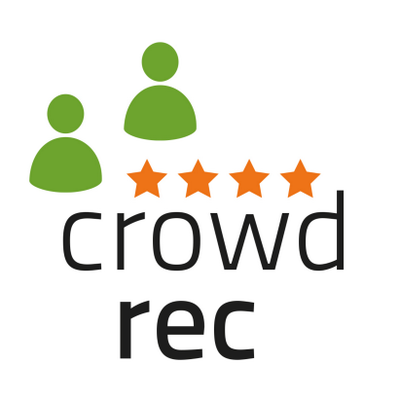

##Organizers
email: info[at]recsyschallenge.com

twitter: <a href="http://twitter.com/recsyschallenge" target="_blank">@recsyschallenge</a>

- **<a href="http://www.alansaid.com">Alan Said</a>** - CWI, The Netherlands  <a href="http://twitter.com/alansaid">@alansaid</a> 
- **<a href="http://www.wica.intec.ugent.be/members/simon-dooms">Simon Dooms</a>** - Ghent University, Belgium <a href="http://twitter.com/sidooms">@sidooms</a> 
- **<a href="http://babak-loni.com/">Babak Loni</a>** - TU Delft, The Netherlands <a href="http://twitter.com/Babak_Loni">@babak_loni</a>
- **<a href="http://www.tmit.bme.hu/tikk.domonkos">Domonkos Tikk</a>** - Gravity R&D, Hungary <a href="http://twitter.com/domonkostikk">@domonkostikk</a> 

##Program Committee
tba

##Acknowledgment
Organizers would like to thank the European 7th FP project <a href="http://crowdrec.eu">CrowdRec</a> <a href="https://twitter.com/CrowdRec">@CrowdRec</a> for supporting the 2014 RecSys Challenge.

