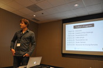

#The program

The RecSys Challenge workshop will take place in the __Syracuse__ room on Friday October 10th.
##Schedule

<table class="table-bordered table-striped table-condensed table-nonfluid">
  
    <tr>
        <th class="col-md-1">Time</th>
        <th class="col-md-6">Title</th>
        <th class="col-md-5">Authors</th>
    </tr>
  
    <tr>
        <td>9:00-9:15</td>
        <td>Welcome <a href='http://www.slideshare.net/simondooms/rec-syschallenge2014intro'> (slides) </a>   </td>
        <td>The Organizers</td>
    </tr>
    <tr>
        <td>9:15-9:30</td>
        <td>An Analysis of the 2014 RecSys Challenge <a href='http://www.slideshare.net/robertoturrin/turrin-rec-syschallengepresentationrecsys2014'> (slides)</a></td>
        <td>Daniele Loiacono, Andreas Lommatzsch, <i><b>Roberto Turrin</b></i></td>
    </tr>
    <tr>
        <td>9:30-9:45</td>
        <td>Team QUTrs: <a href="https://www.youtube.com/watch?v=amrPijBqgGY" target="_blank">Utilizing Voting Systems for Ranking User Tweets</a></td>
        <td>Ahmad Abdel-Hafaz, Quoc Viet Phung, Yue Xu</td>
    </tr>
    <tr>
        <td>9:45-10:00</td>
        <td>Team PILOTS: A Two Step Ranking Solution for Twitter User Engagement <a href='http://www.slideshare.net/BehnoushAbdollahi/recsys-slidesv2'> (slides)</a></td>
        <td><i><b>Behnoush Abdollahi</b></i>, Mahsa Badami, Gopi Chand Nutakki, Olfa Nasraoui, Wenlong Sun </td>
    </tr>
    <tr>
        <td>10:00-10:15</td>
        <td>Team UT-IIS: <a href="https://www.youtube.com/watch?v=8QLOEfJHvCg" target="_blank">Regression and Learning to Rank Aggregation for User Engagement Evaluation</a></td>
        <td>Hamed Zamani, Azadeh Shakery, Pooya Moradi</td>
    </tr>    
    <tr>
        <td>10:15-10:30 </td>
        <td>Team BenHuns: RecSys Challenge 2014: An Ensemble of Binary Classifiers and Matrix Factorization <a href="http://info.ilab.sztaki.hu/~rpalovics/challenge-prez.html"> (slides)</a></td>
        <td> <i><b>Róbert Pálovics</b></i>, Andras A. Benczur, Frederick Ayala-Gómez, Levente Kocsis, Bálint Daróczy, Balázs Csikota, Dominic Spadacene</td>
    </tr>    
    <tr>
        <td>10:30-11:00 </td>
        <td>Coffee break </td>
        <td> </td>
    </tr>    
    <tr>
        <td>11:00-11:15 </td>
        <td>Team Inria Sequel: User Engagement as Evaluation: A Ranking or a Regression Problem <a href='http://www.slideshare.net/Bad_astronaut/presentation-recsys'> (slides) </a></td>
        <td> <i><b>Frédéric Guillou</b></i>, Romaric Gaudel, Jérémie Mary, Philippe Preux </td>
    </tr>    
        <tr>
        <td> 11:15-11:30 </td>
        <td>Team The Crone: Ranking approach to RecSys Challenge </td>
        <td>Pallavi Singh, <b><i>Gyanit Singh</i></b>, Anurag Bhardwaj</td>
        </tr>   
        <tr>
        <td> 11:30-12:15 </td>
        <td>Poster Session </td>
        <td></td>
    </tr>   
    
    
    <tr>
        <td>12:15-12:30  </td>
        <td>Discussion and Closing remarks</td>
        <td> </td>
     </tr>   
</table>

##Posters
Posters will also be presented during the coffee break.

<table class="table-bordered table-striped table-condensed">
    <tr>
        <th>Title</th>
        <th>Authors</th>
    </tr>
      <tr>
        <td>Team SUD: Predicting User Engagement in Twitter with Collaborative Ranking <a href='http://www.slideshare.net/bluebalamx/2014-recsys-challenge6suddiazavilespostera4'> (poster) </a></td>
        <td><i><b>Ernesto Diaz-Aviles</b></i>, Hoang Thanh Lam, Fabio Pinelli, Stefano Braghin, Yiannis Gkoufas, Michele Berlingerio, Francesco Calabrese</td>
      </tr>   
      <tr>
        <td>Team UCD: Exploring Tweet Engagement in the RecSys 2014 Data Challenge <a href='http://www.slideshare.net/JacekWasilewski1/rec-sys2014challengeworkshop'> (poster)</a></td>
        <td> <i><b>Jacek Wasilewski</b></i>, Neil Hurley</td>
      </tr>   
       <tr>
        <td>Team TIPS: A Recommender System for Predicting User Engagement in Twitter <a href='http://pt.slideshare.net/jonmagal/recsys-2014'> (poster) </a></td>
        <td><i><b>Jonathas Magalhães</b></i>, Rubens Pessoa, Cleyton Souza, Evandro Costa, Joseana Fechine </td>
      </tr>  
       <tr>
        <td>Team Pilgrims: Recommender System Based on Modularity <a href='http://www.slideshare.net/inden/poster-maria'> (poster) </a></td>
        <td>Maria Sibaldo, Tiago de Carvalho, <i><b>Ing Ren Tsang</b></i>, George Cavalcanti </td>
      </tr>  
       <tr>
        <td>Team IITM: How Popular are Your Tweets?  </td>
        <td><b><i>Avijit Saha</i></b>, Shubhranshu Shekhar, Janarthanan R and Balaraman Ravindran  </td>
      </tr>  
       <tr>
        <td>Team Punam's Five: Online Tweet Recommendation Using Extreme Learning Machine</td>
        <td>Punam Bedi, Sumit Agarwal, Pooja Vashisth, Samarth Sharma, Tushar Aggarwa. <b><i>Arun Gupta</i></b> </td>
      </tr>  
      <tr>
        <td>Team SemWexMFF: Hybrid Biased k-NN to Predict Movie Tweets Popularity <a href='http://www.slideshare.net/LadislavPeska/recsys-challenge-2014'> (poster) </a></td>
        <td><i><b>Ladislav Peska</b></i>, Peter Vojtas</td>
      </tr>  
</table>

